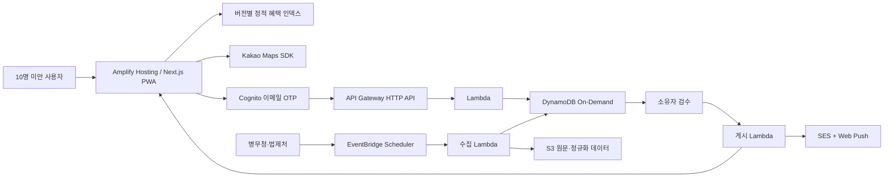

# 파일럿 아키텍처

## 핵심 경계

- 브라우징: 정적 파일만 사용하며 인증이 필요 없습니다.
- 위치: 정확한 좌표는 브라우저 메모리와 Web Worker 안에서만 처리합니다.
- 사용자 데이터: 이메일, 구독, 푸시 endpoint만 인증 API를 통해 저장합니다.
- 콘텐츠: 원문과 후보 버전은 S3, 검수 상태와 구독은 DynamoDB에 저장합니다.
- 게시: 승인된 dataset만 정적 빌드에 포함하며 이전 dataset으로 되돌릴 수 있습니다.

## 비용 절감 선택

- 단일 계정·단일 리전·단일 환경
- WAF, Step Functions, Fargate, Aurora, OpenSearch 제외
- DynamoDB On-Demand와 예약 실행 Lambda
- Amplify 기본 도메인과 SES sandbox
- 14일 로그, 180일 원천 스냅샷

## 고도화 경계

사용자 30명 초과, 링크 유출 우려, 월 API 요청 10만 건 초과, 검색 노출 필요 또는 운영자 추가 시 초대 인증, WAF, 사용자 도메인, dev/prod 계정 분리와 강화된 관측성을 도입합니다.
